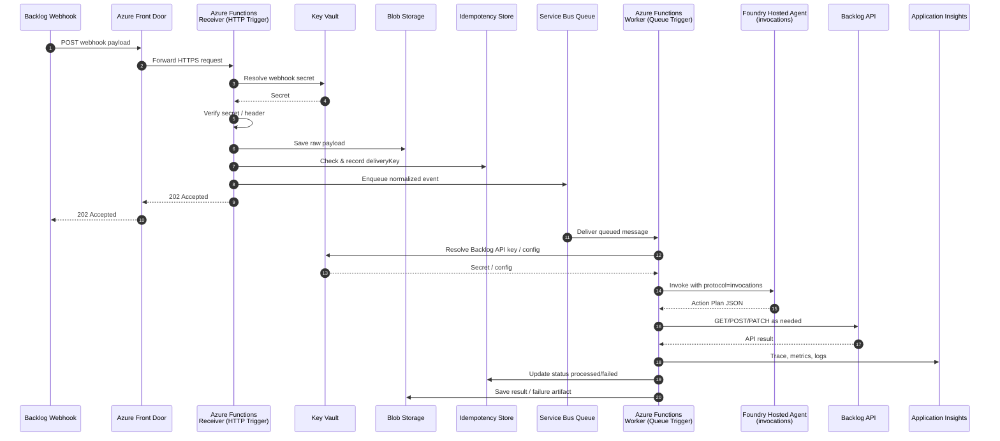

# Foundry Hosted Agents `invocations` + Backlog Webhook による Backlog エージェント設計

## 結論

Backlog Webhook と Foundry Hosted Agents の `invocations` を組み合わせる場合、**Backlog から Foundry Hosted Agent を直接呼ぶのではなく、公開 webhook 受信レイヤーを 1 段置く構成**が最も現実的です。

理由は 2 つです。

1. Backlog Webhook は **Backlog から到達可能な公開 URL** が必要
2. Foundry Hosted Agent の `invocations` は **Bearer トークン前提の Foundry データプレーン呼び出し**なので、Backlog 側からそのまま安全に叩かせる構成に向きません

そのため、設計の中心は次の 3 層です。

1. **Webhook Ingress**: Backlog からイベントを受ける
2. **Agent Runtime**: Foundry Hosted Agent (`invocations`) で判断・要約・アクション計画を作る
3. **Action Executor**: Backlog API v2 で課題更新・コメント投稿を行う

---

## この設計で作る Backlog エージェント

想定する Backlog エージェントは、Backlog の課題イベントを受けて **自動整理・優先度提案・担当候補提案・コメント生成・定型更新** を行うエージェントです。

代表ユースケース:

- 課題作成時にタイトル/本文から **カテゴリ分類**
- 緊急度や影響範囲から **priority / issue type / assignee 候補** を提案
- コメント追加時に **次アクションを要約**
- 特定キーワードで **Wiki / 過去課題 / 運用ルール** を参照して返答案を作成
- 一定条件で **Backlog に自動コメント**
- 自動更新は危険なものを避け、まず **提案だけ返すモード**も選べる

---

## 推奨アーキテクチャ

```text
Backlog Webhook
  -> Public Webhook Receiver
      -> Signature/Secret Verify
      -> Event Normalize / Idempotency Check
      -> Queue
          -> Foundry Invoker
              -> Foundry Hosted Agent (protocol: invocations)
                  -> Backlog Context Fetcher
                  -> LLM Reasoning / Rules / Memory
                  -> Action Plan JSON
          -> Policy Gate
              -> Backlog API Executor
                  -> Comment / Update Issue / Add Notification
```

### Mermaid: 推奨アーキテクチャ

```mermaid
flowchart LR
    backlog[Backlog Webhook]
    receiver[Public Webhook Receiver]
    verify[Signature / Secret Verify]
    normalize[Event Normalize / Idempotency Check]
    queue[Queue]
    invoker[Foundry Invoker]
    agent[Foundry Hosted Agent<br/>protocol: invocations]
    context[Backlog Context Fetcher]
    llm[LLM Reasoning / Rules / Memory]
    plan[Action Plan JSON]
    gate[Policy Gate]
    executor[Backlog API Executor]
    result[Comment / Update Issue / Add Notification]

    backlog --> receiver
    receiver --> verify
    verify --> normalize
    normalize --> queue
    queue --> invoker
    invoker --> agent
    agent --> context
    context --> llm
    llm --> plan
    plan --> gate
    gate --> executor
    executor --> result
```



### コンポーネント

| コンポーネント | 役割 | 推奨実装 |
|---|---|---|
| Webhook Receiver | Backlog から POST を受ける公開入口 | Azure Functions または Azure Container Apps |
| Verify / Normalize | Secret 検証、イベント種別判定、共通 JSON へ変換 | Receiver 内の軽量処理 |
| Queue | 再試行、バースト吸収、非同期化 | Azure Queue Storage / Service Bus |
| Foundry Invoker | Queue から Foundry Agent の `invocations` を呼ぶ | Functions / Container Apps job |
| Hosted Agent | 判断・要約・アクション計画の生成 | Foundry Hosted Agent |
| Policy Gate | 実行可能アクションの制約確認 | Invoker 側または専用サービス |
| Backlog Executor | Backlog API v2 を実行 | 同上 |
| Observability | トレース、失敗分析、継続評価 | App Insights + Foundry trace/eval |

---

## Webhook Receiver を Azure PaaS で構成する設計

Webhook Receiver は、Azure PaaS 前提なら **Azure Functions を中心に据える構成** が最も扱いやすいです。

推奨構成:

```text
Backlog Webhook
  -> Azure Front Door (WAF 任意)
      -> Azure Functions (HTTP Trigger)
          -> Blob Storage (raw payload archive)
          -> Idempotency Store (Azure Table Storage)
          -> Service Bus Queue
              -> Azure Functions (Queue Trigger Worker)
                  -> Foundry Hosted Agent (invocations)
                  -> Backlog API Executor
                  -> App Insights
                  -> Key Vault
```

### Mermaid: Azure PaaS 構成での通信の流れ



### Azure PaaS 構成の役割分担

| Azure サービス | 役割 | 設計ポイント |
|---|---|---|
| Azure Front Door | 公開入口、TLS 終端、WAF | 必須ではないが、本番では付けたい |
| Azure Functions (HTTP) | Webhook 受信 | 速く 2xx を返す。重い処理はしない |
| Blob Storage | 生 webhook payload 保管 | 障害解析、再処理、監査向け |
| Azure Table Storage | 重複排除、delivery 状態管理 | `PartitionKey` / `RowKey` で一意管理しやすい |
| Service Bus | 非同期化、再試行、dead-letter | 本番推奨。順序や再送管理がしやすい |
| Azure Functions (Queue) | Worker | Foundry invoke と Backlog API 実行 |
| Key Vault | Backlog API Key / secret 保管 | Managed Identity で参照 |
| Application Insights | ログ、メトリクス、分散トレース | delivery 単位で追えるようにする |

### 推奨する Azure PaaS の基本形

最初の実装では次の 2 パターンに分けると分かりやすいです。

| パターン | 構成 | 向いている段階 |
|---|---|---|
| MVP | Functions + Queue Storage + Table Storage + Key Vault | まず動かす段階 |
| 本番標準 | Front Door + Functions + Service Bus + Blob + Key Vault + App Insights | 運用を見据えた段階 |

### 推奨理由

Azure Functions を Receiver にする利点:

- HTTP endpoint をすぐ公開できる
- Backlog Webhook の burst を吸収しやすい
- Queue Trigger と組み合わせやすい
- Managed Identity が使える
- App Insights 連携が自然

一方で、**Receiver に Azure Container Apps を選ぶ必要は薄い**です。常時起動プロセスや独自ミドルウェアが強く必要でない限り、Webhook 受信は Functions の方が単純です。

### HTTP Trigger Function の責務

HTTP Trigger 側では次だけを行います。

1. Backlog からの POST 受信
2. Secret / header 検証
3. raw body の保存
4. `deliveryId` か hash による idempotency 判定
5. Queue / Service Bus へメッセージ投入
6. すぐに 200 または 202 を返す

この Function では **Foundry invoke を直接呼ばない** のが原則です。

### Queue 設計

Queue は Azure Storage Queue でも動きますが、運用を考えると **Service Bus Queue** が有力です。

Service Bus を推す理由:

- dead-letter queue が扱いやすい
- 再試行制御がしやすい
- delivery 単位の失敗管理がしやすい
- 将来の優先度キューや分離がしやすい

推奨キュー名の例:

- `backlog-webhook-ingress`
- `backlog-agent-actions`
- `backlog-agent-deadletter`

### Idempotency Store 設計

Idempotency Store は **Azure Table Storage** を前提にします。Backlog Webhook は再送を考慮して、重複処理を避ける必要があります。

この用途では Table Storage が扱いやすい理由があります。

- 安価でシンプル
- key-value に近いアクセスが多い
- `PartitionKey` / `RowKey` で一意制御しやすい
- Functions から扱いやすい
- Blob Storage と同じ Storage Account にまとめやすい

### テーブル設計

テーブル名の例:

- `backlogIdempotency`

推奨キー設計:

| 列 | 役割 |
|---|---|
| `PartitionKey` | `projectKey:eventType:yyyyMMdd` などの集約キー |
| `RowKey` | `deliveryKey` |
| `Status` | received / queued / processed / failed |
| `IssueKey` | 課題単位追跡 |
| `PayloadHash` | 補助ハッシュ |
| `ReceivedAt` | 受信時刻 |
| `ProcessedAt` | 処理完了時刻 |
| `ExpiresAt` | TTL 相当の運用用日時 |

`PartitionKey` は検索性とホットパーティション回避のバランスを見て、**プロジェクト + イベント種別 + 日付** くらいに分けるのが無難です。

保存したい項目:

| 項目 | 用途 |
|---|---|
| `deliveryKey` | 一意判定キー |
| `eventType` | 種別 |
| `projectKey` | 集計・検索 |
| `issueKey` | 課題単位の追跡 |
| `receivedAt` | 受信時刻 |
| `status` | received / queued / processed / failed |
| `payloadHash` | deliveryId が弱い場合の補助 |

`deliveryId` が安定して取れない実装では、**event type + project + issue/comment id + created timestamp + body hash** を合成キーにします。

Function 実装では、まず `PartitionKey` + `RowKey` で entity 作成を試み、既存なら重複として処理を打ち切る形にすると分かりやすいです。

### Blob Storage 設計

raw payload は Blob Storage に保存しておくと、以下に効きます。

- webhook 失敗時の再処理
- 推論ミス時の再現
- 監査ログ
- 評価データ作成

推奨コンテナー:

- `backlog-webhook-raw`
- `backlog-agent-results`
- `backlog-agent-dlq`

### Key Vault と秘密情報

Key Vault に置く対象:

- Backlog API Key
- Backlog Webhook secret
- 必要なら運用通知先の webhook secret

Functions と Worker には **System-assigned Managed Identity** を付けて参照させます。

### Front Door / WAF の使い方

Backlog から到達可能な URL が必要なので、公開入口は Front Door が扱いやすいです。

Front Door を入れるメリット:

- HTTPS 終端を統一できる
- WAF ルールを前段に置ける
- 将来 Receiver を差し替えやすい
- 独自ドメインを使いやすい

ただし Backlog Webhook 側は一般的な SaaS webhook なので、**mTLS 前提の設計にはしない**方がよいです。認証は secret 検証を基本にします。

### 監視設計

Application Insights では最低限、次を追跡します。

- `deliveryKey`
- `eventType`
- `projectKey`
- `issueKey`
- Queue enqueue latency
- Foundry invoke latency
- Backlog API success/failure
- 自動反映の成否

Receiver と Worker のログは、同じ `deliveryKey` を custom dimension に入れて相関できるようにします。

### Azure PaaS 版の推奨デプロイ単位

| デプロイ単位 | Azure リソース |
|---|---|
| Edge | Front Door |
| Ingress | Function App (HTTP Trigger) |
| Messaging | Service Bus, Storage Account |
| Processing | Function App (Queue Trigger) |
| Secrets | Key Vault |
| Observability | App Insights, Log Analytics |

Function App を 1 つにまとめることもできますが、運用上は **Ingress Function** と **Worker Function** を分けた方が責務が明確です。

### この設計の判断

Azure PaaS で Receiver を組むなら、結論は **「Front Door + Functions + Service Bus + Blob + Key Vault + App Insights」** が本命です。

これにより、Backlog Webhook に必要な公開性と、Foundry Hosted Agent に必要な認証付き非同期実行を安全につなげられます。

---

## なぜ `invocations` を使うのか

`responses` ではなく `invocations` を選ぶ理由は、Webhook の入力が自然言語ではなく **Backlog 固有 JSON** だからです。

`invocations` は bytes in / bytes out なので、Backlog から受けたイベントを以下のような **構造化 payload** のまま Hosted Agent に渡せます。

- `eventType`
- `project`
- `issue`
- `comment`
- `actor`
- `deliveryId`
- `receivedAt`
- `policyMode`

これにより、エージェントは「会話」ではなく **イベント駆動の業務処理** として動けます。

Build 2026 の Hosted Agents 文脈でも、`invocations` は webhook caller や protocol bridge に向くものとして整理されており、関連セッションは以下です。

- [LIVE170](https://build.microsoft.com/en-US/sessions/LIVE170)
- [BRK241](https://build.microsoft.com/en-US/sessions/BRK241)
- [BRK243](https://build.microsoft.com/en-US/sessions/BRK243)
- [LAB540](https://build.microsoft.com/en-US/sessions/LAB540)
- [DEM333](https://build.microsoft.com/en-US/sessions/DEM333)

---

## 重要な設計判断

## 1. Backlog から Foundry へ直接入れない

Backlog Webhook は公開 URL を要求します。一方、Foundry Hosted Agent の `invocations` は Foundry 側の認証が必要です。

したがって推奨は:

- **Backlog -> Webhook Receiver**
- **Receiver/Worker -> Foundry Agent**

です。

この 1 段を入れることで、次も実現しやすくなります。

- idempotency
- リトライ
- 負荷平準化
- 署名/secret 検証
- 危険操作のガード
- dead-letter

## 2. エージェントに直接書き換えさせず、まず Action Plan を返す

最初から Hosted Agent が Backlog API を直接実行する構成もできますが、初期設計では **plan/executor 分離** を推奨します。

### 推奨フロー

1. Hosted Agent は **Action Plan JSON** を返す
2. Policy Gate が許可された操作だけ通す
3. Executor が Backlog API を呼ぶ

これにより、誤更新や過剰自動化を抑えやすくなります。

---

## イベント処理フロー

## フロー A: 課題作成

1. Backlog で課題作成
2. Webhook Receiver がイベント受信
3. Secret / signature / header を検証
4. `deliveryId` とイベント本文から重複チェック
5. Queue へ投入
6. Worker が Foundry Hosted Agent `invocations` を呼ぶ
7. Agent が Backlog API で詳細取得
8. Agent が分類・要約・優先度候補・担当候補を生成
9. Agent が Action Plan JSON を返す
10. Policy Gate が許可操作だけ実行
11. Backlog にコメント追加または課題更新

## フロー B: コメント追加

1. コメント追加イベント受信
2. `sessionId` を対象課題単位で決定
3. Agent が過去の同課題コンテキストを復元
4. 「次に誰が何をすべきか」を要約
5. 必要なら Backlog コメントとして投稿

---

## `sessionId` 設計

`invocations` では `conversationId` ではなく **`sessionId` を再利用**して状態を持たせるのが重要です。

推奨ルール:

| 単位 | `sessionId` 例 | 用途 |
|---|---|---|
| 課題単位 | `bk-prj1-issue-12345` | 1 課題の継続判断、コメント要約 |
| Wiki 単位 | `bk-prj1-wiki-678` | Wiki 更新レビュー |
| プロジェクト単位 | `bk-prj1-routing` | プロジェクト共通のルーティング判断 |

基本方針は **課題単位セッション** です。これが最も自然です。

理由:

- 課題ごとの文脈を蓄積しやすい
- 同じ課題の comment-added に追従しやすい
- stateful resume と相性が良い

---

## Webhook Receiver の責務

Receiver では重い推論をせず、以下だけを担当します。

### 必須

- Backlog Webhook の HTTP 受信
- Secret / ヘッダー検証
- 生 payload 保存
- delivery id またはハッシュによる重複排除
- Queue 投入
- 即時 2xx 応答

### やらない方がよいこと

- その場で LLM 推論
- その場で Backlog API を大量呼び出し
- 長時間処理

理由は、Webhook 受信点は **早く返すことが最優先**だからです。

---

## Hosted Agent の責務

Hosted Agent 側は、`invocations` のリクエストを受けて以下を実施します。

1. イベント種別の理解
2. 追加コンテキスト取得
3. ルール判定
4. LLM による判断
5. 構造化 Action Plan 出力

### Agent 内部モジュール案

| モジュール | 役割 |
|---|---|
| Event Router | `issue_created`, `comment_added` などで分岐 |
| Backlog Client | Backlog API v2 呼び出し |
| Context Builder | 課題本文、コメント履歴、Wiki、ルール集を集約 |
| Policy Rules | 自動実行可否のルール判定 |
| LLM Planner | 要約、分類、提案生成 |
| Action Formatter | 実行可能な JSON 契約へ整形 |

---

## `invocations` リクエスト/レスポンス契約

## Request 例

```json
{
  "schemaVersion": "1.0",
  "source": "backlog-webhook",
  "deliveryId": "evt-20260618-001122",
  "receivedAt": "2026-06-18T22:58:57+09:00",
  "project": {
    "projectKey": "OPS",
    "projectId": 123456
  },
  "event": {
    "type": "issue_created",
    "rawType": 1
  },
  "resource": {
    "issueKey": "OPS-431",
    "issueId": 998877,
    "commentId": null
  },
  "actor": {
    "userId": 1001,
    "name": "yuta"
  },
  "policy": {
    "mode": "suggest_only",
    "allowComment": true,
    "allowIssueUpdate": false
  },
  "payload": {
    "rawWebhookBody": {}
  }
}
```

## Response 例

```json
{
  "status": "ok",
  "sessionId": "bk-ops-issue-998877",
  "summary": "障害報告として分類し、優先度 High を提案しました。",
  "observations": [
    "タイトルに API timeout を含む",
    "本文に本番影響ありと記載"
  ],
  "actions": [
    {
      "type": "comment_add",
      "mode": "auto",
      "body": "Backlog Agent: 本課題は本番影響がある障害報告の可能性が高いため、優先度 High を推奨します。"
    },
    {
      "type": "issue_update",
      "mode": "manual_review",
      "fields": {
        "priorityId": 3,
        "assigneeId": 2002
      }
    }
  ]
}
```

ポイントは、**レスポンスも自然文だけでなく JSON に固定する**ことです。

---

## Backlog API の使い方

Backlog API v2 では Webhook 管理と課題更新の両方を扱えます。

この設計で最低限使う API:

| 用途 | API |
|---|---|
| Webhook 登録 | `POST /api/v2/projects/{projectIdOrKey}/webhooks` |
| Webhook 確認 | `GET /api/v2/projects/{projectIdOrKey}/webhooks` |
| 課題取得 | `GET /api/v2/issues/{issueIdOrKey}` |
| 課題検索 | `GET /api/v2/issues` |
| コメント追加 | `POST /api/v2/issues/{issueIdOrKey}/comments` |
| 課題更新 | `PATCH /api/v2/issues/{issueIdOrKey}` |
| Wiki 取得 | `GET /api/v2/wikis/{wikiId}` |

認証は Backlog API Key または OAuth 2.0 を使えますが、運用面では **API Key を Key Vault に置き、Managed Identity で取得**する構成が単純です。

---

## セキュリティ設計

## 1. 公開面は Receiver だけ

インターネット公開するのは Webhook Receiver のみとし、Hosted Agent や実行系を直接公開しません。

## 2. Backlog 秘密情報の扱い

- Backlog API Key は Key Vault 保存
- Receiver/Worker/Executor は Managed Identity で取得
- コードや環境変数に平文で固定しない

## 3. Webhook 検証

最低限、以下を行います。

- Backlog 側で設定した secret の検証
- リクエスト本文の raw 保存
- replay 防止のための idempotency 記録

## 4. 操作ガード

初期段階では以下のように制限します。

- 自動コメントは許可
- 課題の status / assignee / priority 更新は manual review
- issue delete 相当の危険操作は未対応

---

## 運用モード

| モード | 挙動 | 使いどころ |
|---|---|---|
| `suggest_only` | コメント草案や更新案のみ返す | 初期導入 |
| `comment_auto` | コメントのみ自動反映 | 最初の本番導入 |
| `safe_mutation` | priority / assignee など限定更新 | 運用安定後 |
| `full_auto` | 許可された更新を自動実行 | 強い統制ルールがある場合のみ |

最初は **`suggest_only` -> `comment_auto`** の順が安全です。

---

## 代表シナリオ

## シナリオ 1: 障害チケットの自動初動

- 課題タイトルと本文を解析
- 既知障害や過去チケットを検索
- 緊急度を推定
- コメントで初動手順を提示

## シナリオ 2: コメントから次アクションを抽出

- コメント追加イベントを受信
- 現在の論点を要約
- 誰のボールかを判定
- コメントで ToDo を返す

## シナリオ 3: 定型ルールの適用

- 特定 issue type ならテンプレチェック
- 必須情報不足なら確認コメント
- リリース blocker 条件なら優先度を提案

---

## 失敗時の扱い

| 失敗箇所 | 対応 |
|---|---|
| Webhook 検証失敗 | 4xx を返し、処理しない |
| Queue 送信失敗 | 再試行、最終的に dead-letter |
| Foundry invoke 失敗 | Worker 側で指数バックオフ |
| LLM 判断失敗 | コメント自動投稿を止め、運用通知へ |
| Backlog API 更新失敗 | action 単位で記録し再試行 |

---

## 観測性

Build 2026 の Hosted Agents では observe / trace / eval が重要です。この Backlog エージェントでも以下を持たせます。

- `deliveryId`
- Backlog `projectKey` / `issueKey`
- Foundry `sessionId`
- action execution result
- 処理レイテンシ
- 自動実行率
- 人手修正率

特に **「エージェントの提案が採用されたか」** を継続評価の軸にすると改善しやすいです。

---

## MVP 範囲

最初の MVP は以下で十分です。

1. Backlog の `issue_created` と `comment_added` のみ対応
2. Webhook Receiver + Queue + Worker + Foundry Hosted Agent を構築
3. Hosted Agent は Action Plan JSON を返す
4. 自動反映は **コメント追加のみ**
5. priority / assignee 更新は提案だけ

---

## 実装順

1. **Webhook Receiver を作る**
2. **Backlog Webhook を登録する**
3. **Queue 経由の非同期処理を入れる**
4. **Foundry Hosted Agent を `invocations` で実装する**
5. **Action Plan JSON 契約を固定する**
6. **Backlog Executor を作る**
7. **suggest_only で評価する**
8. **comment_auto に昇格する**

---

## 一言でいうと

この Backlog エージェント設計の本質は、**Backlog Webhook をイベント入力、Foundry Hosted Agents `invocations` を判断エンジン、Backlog API を実行面として分離する**ことです。

これにより、Webhook 駆動の業務イベントを安全に受け、Foundry の stateful / observable な agent runtime を使って、Backlog 上の実務オペレーションへつなげられます。
